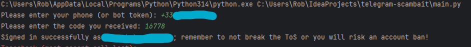

`pip install openai telethon`
`python -m pip install --upgrade pip setuptools wheel`
`python -m pip install telethon openai rlottie-python Pillow`

 python3 main.py
 -> login with phone number
 -> enter code
 -> exit

 edit run.sh file with file path

bash run.sh
